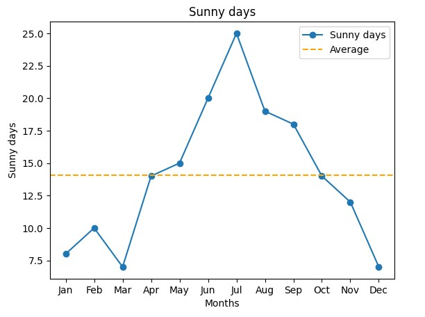

# ☀️ Monthly Sunny Days Data Visualization

This project visualizes the number of sunny days recorded each month using **Python** and **Matplotlib**. It highlights seasonal trends and compares monthly values against the yearly average to provide quick visual insights.

---

## 📊 Project Overview

The chart displays:
- Monthly sunny day counts from **January to December**
- A **line plot** with markers for clear data points
- A **horizontal dashed line** representing the annual average number of sunny days

---

## 🖼️ Visualization Output



> The dashed orange line represents the average number of sunny days across the year.

---

## 🛠️ Technologies Used

- **Python**
- **Matplotlib**

---

## 📁 Dataset

```python
sunny_days = [8, 10, 7, 14, 15, 20, 25, 19, 18, 14, 12, 7]
months = ["Jan", "Feb", "Mar", "Apr", "May", "Jun", "Jul",
          "Aug", "Sep", "Oct", "Nov", "Dec"]
